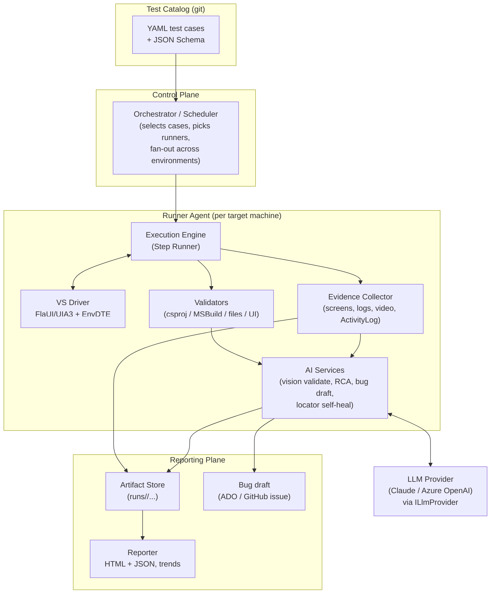
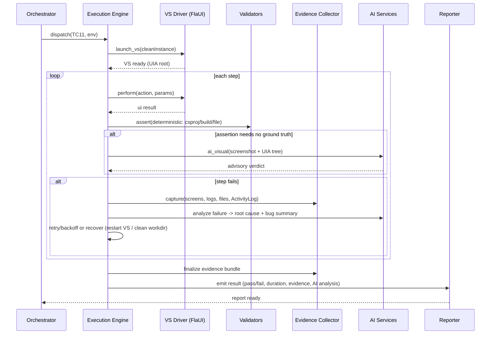
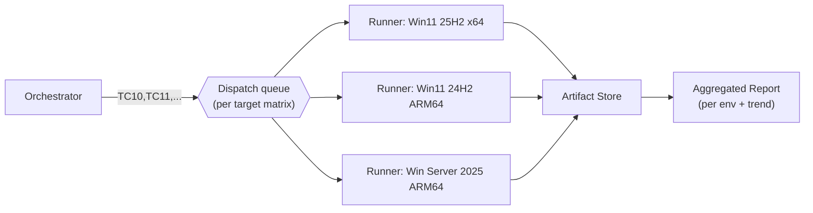

# Architecture Diagrams

## 1. Component / layer view

## 2. Single test-case execution flow (sequence)

## 3. Multi-environment fan-out

> **Parallelism rule:** one Visual Studio instance per runner/VM (serial within a box to
> avoid UIA contention and shared global VS state); parallelism comes from fanning the same
> case set across multiple machines/VMs.
